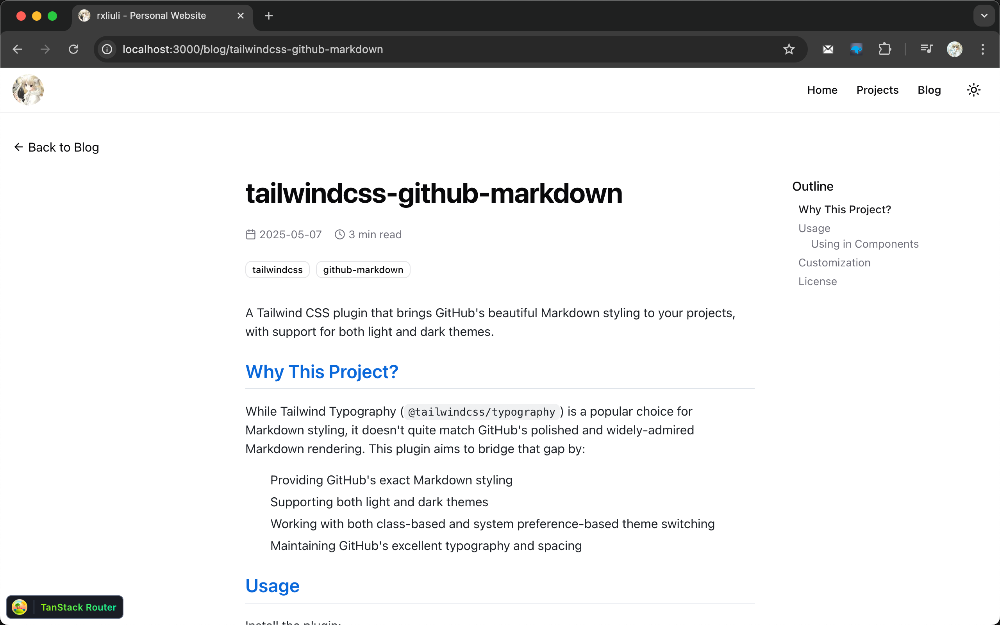
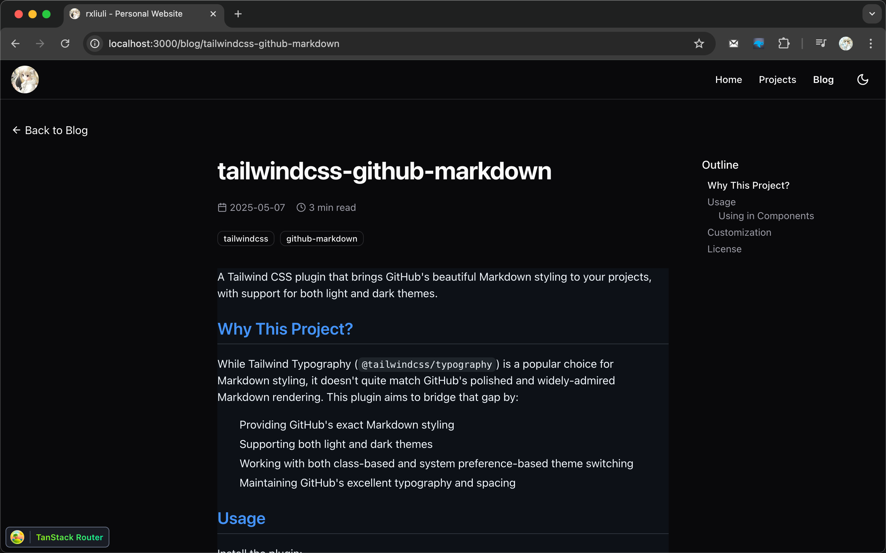

# tailwindcss-github-markdown

A Tailwind CSS plugin that brings GitHub's beautiful Markdown styling to your projects, with support for both light and dark themes.

## Why This Project?

While Tailwind Typography (`@tailwindcss/typography`) is a popular choice for Markdown styling, it doesn't quite match GitHub's polished and widely-admired Markdown rendering. This plugin aims to bridge that gap by:

1. Providing GitHub's exact Markdown styling
2. Supporting both light and dark themes
3. Working with both class-based and system preference-based theme switching
4. Maintaining GitHub's excellent typography and spacing

## Screenshots

### Light Theme



### Dark Theme



## Usage

Install the plugin:

```bash
pnpm add -D tailwindcss-github-markdown
```

Add the plugin to your CSS:

```css
/* styles.css */
@import 'tailwindcss';

@plugin 'tailwindcss-github-markdown';
```

### Using in Components

Add the `prose` class to your container element. For dark mode support, add `dark:prose-invert`:

```html
<!-- HTML -->
<div class="prose dark:prose-invert">
  <!-- Your markdown content here -->
</div>
```

```jsx
// React/Next.js
<div className="prose dark:prose-invert">{/* Your markdown content here */}</div>
```

```vue
<!-- Vue -->
<template>
  <div class="prose dark:prose-invert">
    <!-- Your markdown content here -->
  </div>
</template>
```

The `dark:prose-invert` class will automatically switch to dark mode when:

- The parent element has the `dark` class
- The user's system preference is set to dark mode (if you're using Tailwind's dark mode: 'media' setting)

### Customization

You can customize the default styles by overriding them in your CSS. Here are some examples:

```css
.prose a {
  @apply text-primary underline;
}

.prose a:hover {
  @apply text-primary/90;
}
```

All GitHub Markdown styles are applied using the `.prose` class, so you can override any style by targeting the appropriate selector within `.prose`.

## License

MIT
